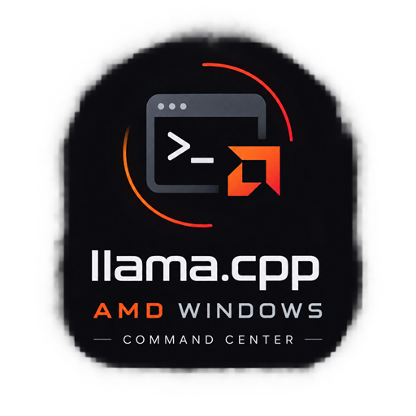
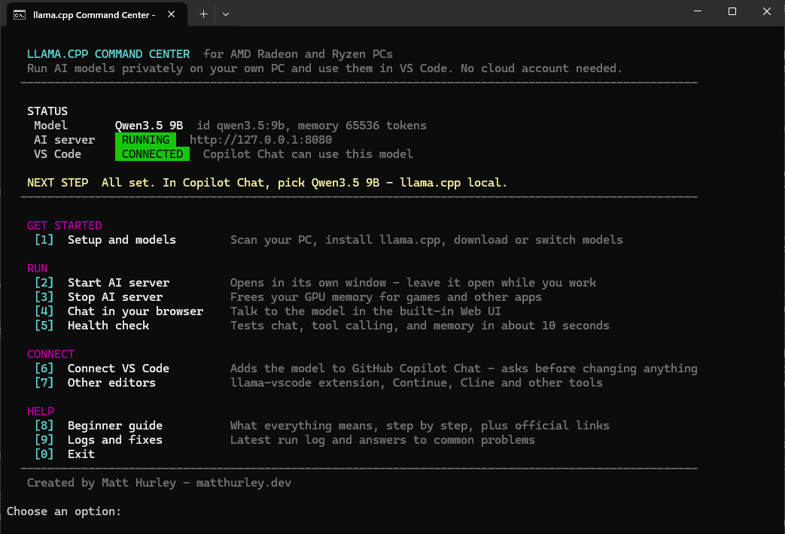
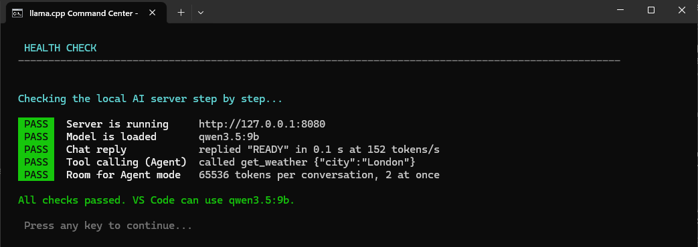
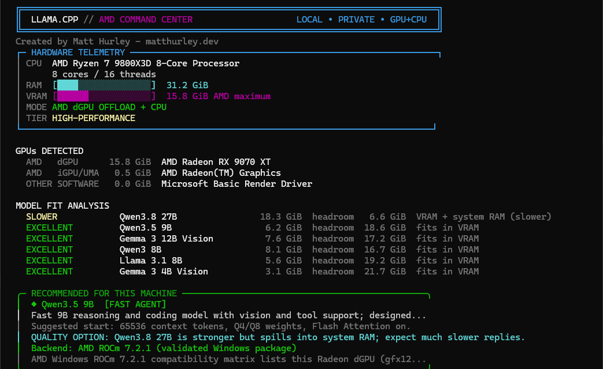

# llama.cpp AMD Command Center

<p align="center">
  
</p>

<p align="center">
  <strong>Run AI models privately on your AMD Radeon PC and use them in VS Code: set up from one friendly Windows menu.</strong><br>
  <a href="https://github.com/theantipopau/llamacpp-amd-command-center/releases/latest">Download</a> ·
  <a href="https://theantipopau.github.io/llamacpp-amd-command-center/">Website</a> ·
  <a href="#troubleshooting">Troubleshooting</a>
</p>

<p align="center">
  <a href="https://github.com/theantipopau/llamacpp-amd-command-center/actions/workflows/ci.yml"></a>
  <a href="https://github.com/theantipopau/llamacpp-amd-command-center/releases/latest"></a>
  <a href="LICENSE"></a>
</p>

**Created by Matt Hurley - [matthurley.dev](https://matthurley.dev)**

> **Community project.** This is an independent helper around [llama.cpp](https://github.com/ggml-org/llama.cpp). It is not affiliated with, endorsed by, or published by ggml-org, AMD, Microsoft, GitHub, Continue, Cline, or Anthropic.



## What you get

- **A local AI model on your own graphics card.** No subscription, no cloud account, and your code stays on your PC.
- **A guided setup.** It scans your CPU, Radeon GPU, and memory, then picks the model and settings that fit. Nothing downloads until you type `YES`, and every model file is checked against its published SHA-256 fingerprint.
- **GitHub Copilot Chat integration.** One menu option adds the model to Copilot Chat, including **Agent mode**, which reads and edits files. Your Copilot account and cloud models stay exactly as they were.
- **A health check** that tests chat, tool calling, and memory in about 10 seconds and explains any failure in plain English.

## Before you start

You need:

- **Windows 10 or 11** (64-bit).
- **An AMD Radeon graphics card.** A card with 12–16 GB of memory, such as an RX 7700 XT, 7900, 9060 XT or 9070 XT, gives the best experience. Older and smaller Radeon cards and Ryzen processors with built-in Radeon graphics also work, just more slowly.
- **Any modern processor.** AMD Ryzen and Intel CPUs are both fine. Intel CPUs are supported as the main processor; Intel graphics are not used to run models.
- **About 20 GB of free disk space** for llama.cpp and one model.
- **An internet connection** for the one-time downloads. After that, everything runs offline.
- **Optional: VS Code with the GitHub Copilot Chat extension**, if you want the model inside your code editor. You can also skip VS Code and chat in your web browser.

No programming or AI knowledge is needed. The menu explains each step and always asks before downloading anything.

## Words you will see

| Word | What it means |
|---|---|
| **Model** | The AI itself: one large file (about 6 GB) that does the thinking. You can download several and switch between them. |
| **AI server** | A program that loads the model onto your graphics card so apps can talk to it. It runs in its own window; close the window and the AI stops. |
| **VRAM** | Your graphics card's own memory. A model that fits entirely in VRAM replies quickly. |
| **Context** | How much of the conversation (and your code) the model can keep in mind at once, measured in **tokens**. A token is roughly three-quarters of a word. |
| **Agent mode** | A Copilot mode where the AI can read and edit files in your project, not just answer questions. |
| **Backend (ROCm / Vulkan)** | The engine that runs the model on your graphics card. The setup picks the right one for you. |

## Quick start

Allow about 15 minutes, most of it the one-time 6 GB model download.

1. **Update your AMD graphics driver** (AMD Software: Adrenalin Edition).
2. **Download** `llamacpp-amd-command-center-vX.Y.Z.zip` from the [latest release](https://github.com/theantipopau/llamacpp-amd-command-center/releases/latest). Right-click it, choose **Extract All**, and open the extracted folder. Do not run it from inside the ZIP.
3. **Double-click `Start-LlamaCpp.cmd`.** Windows may show a SmartScreen warning because the file came from the internet. If you downloaded it from the release page above, choose **More info → Run anyway**.
4. Choose **[1] Setup and models**, then **[1] First-time setup** on the next screen, and type `YES` when asked.
5. Back in the main menu, choose **[2] Start AI server**. A second window opens; leave it open. The menu shows **READY** when the model has loaded.
6. Choose **[5] Health check**. Every line should say **PASS**.
7. Choose **[6] Connect VS Code** and type `YES`. Then follow the four steps it prints (reload VS Code and pick the model).

The **NEXT STEP** line at the top of the menu always tells you what to do next.

### Every day after that

1. Double-click `Start-LlamaCpp.cmd` and choose **[2] Start AI server**. If you have more than one model, pick one by number, or press Enter to keep the last one.
2. Use the model in VS Code, or choose **[4]** to chat in your browser.
3. When you're done, or before gaming, choose **[3] Stop AI server** to free your graphics card.



## The menu

| Option | What it does |
|---|---|
| **[1] Setup and models** | Scans your PC and opens the setup screen: first-time install, model browser, llama.cpp updates, diagnostics, removing a model you no longer need ([11], frees disk space), and uninstall. |
| **[2] Start AI server** | Starts the model in its own window and waits until it is ready. Keep that window open while you work. If you have more than one model downloaded, it first asks which one to run (Enter keeps the current one). Switching is instant and offline, and VS Code follows automatically. |
| **[3] Stop AI server** | Stops the server and frees GPU memory, for example before gaming. Asks first. |
| **[4] Chat in your browser** | Opens the built-in llama.cpp chat page at `http://127.0.0.1:8080/`. |
| **[5] Health check** | Tests that the server is up, the model answers, tool calling works, and there is enough memory for Agent mode. |
| **[6] Connect VS Code** | Adds the model to GitHub Copilot Chat. Makes a backup first and only touches its own entry. |
| **[7] Other editors** | The official llama-vscode extension, a Continue settings file, and settings for Cline or any OpenAI-compatible tool. |
| **[8] Beginner guide** | Plain-English explanations of every term, plus official links. |
| **[9] Logs and fixes** | The latest run log and answers to common problems. |
| **[M] Live monitor** | Watches server status, active model, and prompt/generation speed, refreshing every 2 seconds. Press `Q` then Enter to leave it. |

The status panel shows the active model, whether the AI server is running, and whether VS Code is connected. It also prints a one-line notice if a newer command-center release exists on GitHub — nothing downloads automatically.

## Using the model in VS Code

After **[6] Connect VS Code**:

1. In VS Code press `Ctrl+Shift+P`, type **Reload Window**, and press Enter.
2. Open Copilot Chat with `Ctrl+Alt+I`.
3. Click the model name under the chat box and choose **Qwen3.5 9B - llama.cpp local** (or whichever model you activated).
4. Choose **Agent** to let it read and edit files, or **Ask** for questions.

Switch back to a cloud model at any time from the same list. The AI server must be running (**[2]**) while you use the local model.

**You only connect once.** After that, every time you switch or install a model in the model browser, the VS Code entry updates to that model on its own (with a backup). Reload the VS Code window, restart the AI server, and the picker shows the new model. The server runs one model at a time, so VS Code lists only the active one.

<details>
<summary>Manual setup, if you prefer not to use option [6]</summary>

1. In VS Code run **Chat: Manage Language Models**.
2. Choose **Add Models → Custom Endpoint → Chat Completions**.
3. Endpoint `http://127.0.0.1:8080/v1/chat/completions`, model id `qwen3.5:9b`, API key `local` (any text works).
4. Turn on **Tools** and **Vision**, set the input limit to about 57000 and output to 8192 tokens, save, and reload VS Code.

Option [6] writes exactly this into `%APPDATA%\Code\User\chatLanguageModels.json` as a provider named `llama.cpp local`, keeps every other entry, and saves a backup as `chatLanguageModels.json.command-center.bak`. It refuses to edit the file if it is not valid JSON.
</details>

## Which model?

The setup recommends the **strongest tool-capable model that fits entirely in your graphics card's memory (VRAM)**. Models that spill into system RAM still work, but reply several times more slowly.

| Model | Download | Tool calling (Agent mode) | Vision | Notes |
|---|---:|:---:|:---:|---|
| **Qwen3.5 9B** | 6.2 GB | ✓ | ✓ | **Recommended for 12–16 GB Radeon cards.** On an RX 9070 XT: fully on the GPU, about 45–90 tokens/s (faster in short chats), 64k context. |
| Qwen3.8 27B | 18.3 GB | ✓ | ✓ | Strongest answers, but on a 16 GB card about 5 GB runs from system RAM: roughly 4–7 tokens/s. |
| Qwen3 8B | 8.1 GB | ✓ | | High-quality 8-bit weights. |
| Llama 3.1 8B | 5.6 GB | ✓ | | Proven general-purpose model. |
| Gemma 3 12B | 7.6 GB | | ✓ | Chat and image understanding; not for Agent mode. |
| Gemma 3 4B | 3.1 GB | | ✓ | For 8 GB systems and Ryzen integrated graphics. |
| Qwen3 4B | 2.3 GB | ✓ | | Smallest and fastest; good for CPU-only machines. |
| Ornith 1.5 9B *(experimental)* | 6.2 GB | ✓ | ✓ | A community-tuned version of Qwen3.5 9B aimed at coding. Its makers report better results; that hasn't been checked here. **Not usable on most Radeon cards yet:** it needs the Vulkan backend (the ROCm backend can't load it, and the menu stops you before downloading), and on an RX 9070 XT Vulkan crashed during long sessions. Expect this to change when AMD updates its ROCm package. |

The model browser in **[1]** shows each model's fit for *your* PC: `VRAM` means it fits in graphics memory, `VRAM+RAM` means it spills into system RAM and runs more slowly. Downloads come from Hugging Face; the current revision and SHA-256 are resolved at download time, and files are verified before they are activated.



## How it is tuned for Copilot, and why (optional reading)

These settings came from diagnosing real Copilot failures on an RX 9070 XT. They are applied automatically when you activate a model.

| Setting | Value (Qwen3.5 9B, 16 GB card) | Why |
|---|---|---|
| Context per conversation | 65,536 tokens | Copilot's Agent prompt alone is 26k–40k tokens. Below about 32k, VS Code fails with *No lowest priority node found*. |
| Conversations at once | 2 (`--parallel 2`, 131,072-token pool) | VS Code sometimes sends a second large request (such as a summary) while an Agent turn is running. With room for only one, both fail with *Server error: 500*. |
| Thinking | Off (`--reasoning off`) for tool-capable models | With thinking on, Qwen often hides its tool call inside the thinking text, and VS Code shows *Sorry, no response was returned*. |
| VS Code token budget | 57,344 input / 8,192 output | Matches one conversation's context. |
| Network | `127.0.0.1` only | Other devices on your network cannot reach the server. |

Context is sized from the VRAM left after the model loads, and from each model's measured memory cost per token. Dense 8B models get 32k; hybrid models such as Qwen3.5 need much less memory and get 64k. You can override it:

```powershell
powershell.exe -NoProfile -ExecutionPolicy Bypass -File .\Install-LlamaCpp-AMD.ps1 -Action Models -ModelId qwen3.5-9b -ContextSize 49152
```

## Troubleshooting

Start with **[5] Health check**. It names the failing step and what to do.

| What you see | What to do |
|---|---|
| Health check: *Server is running* **FAIL** | Choose **[2]** and wait for **READY**. Loading takes 5–60 seconds. |
| VS Code: *No lowest priority node found* | The model's context is too small for Copilot. In **[1]** open the model browser, activate your model again (it now gets 64k), then stop and start the server. |
| VS Code: *Sorry, no response was returned* | Your launcher predates the thinking fix. Re-activate the model in **[1]**, then restart the server. |
| VS Code: *Server error: 500* and the server log says *Context size has been exceeded* | Your launcher predates the two-conversation setting. Re-activate the model in **[1]**, then restart the server. |
| VS Code: *ERR_CONNECTION_RESET* | The server stopped or restarted mid-reply. Start it with **[2]** and click **Try again** in Copilot. |
| The model is not in Copilot's model list | Run **[6]** again, then **Reload Window** in VS Code. |
| Replies are very slow | The model does not fit in VRAM. Pick one marked `VRAM` (not `VRAM+RAM`) in the model browser. |
| Graphics card not detected | Update the AMD driver, restart Windows, then run **Diagnostics** from **[1]**. |
| *Install-LlamaCpp-AMD.ps1 is missing* | Extract the whole ZIP and keep both files in the same folder. |
| The model list says a model *cannot run on the installed llama.cpp build* | That model needs a different backend. Pick another model; the Which model? table explains the exceptions. |
| The server window closed by itself | Choose **[9] Logs and fixes**, then start it again with **[2]**. If it keeps happening on the Vulkan backend, see the next row. |
| PC froze, blue-screened (`VIDEO_TDR_FAILURE`, 0x116), or the server log says `device lost on Vulkan0` | On a Radeon that supports ROCm (such as the RX 9070 XT), use the **ROCm backend**. In testing on an RX 9070 XT, the Vulkan build lost the GPU during long Agent sessions (about 58k tokens of context), once taking Windows down with it; ROCm ran for days without a fault. From v0.1.5 the launcher also pins the dedicated Radeon, so Ryzen integrated graphics is never used automatically. |
| VS Code says `code` is not recognized ([7] → llama-vscode) | Install the extension from inside VS Code: Extensions, search **llama-vscode**, Install. |

**[9] Logs and fixes** shows the latest run log. Logs live in `%LOCALAPPDATA%\Programs\llama.cpp\logs`; common API keys and tokens are removed automatically, but look them over before sharing.

## Other editors and tools

- **llama-vscode**: the official llama.cpp VS Code extension (`ggml-org.llama-vscode`) for completion, chat, and agents. Option **[7] → [1]** installs it, then points its `llama-vscode.endpoint*` settings at your server. Every other line in `settings.json` is preserved and a backup is made first. If `settings.json` contains `//` comments, nothing is auto-written — you get the exact lines to paste instead, so comments are never silently lost.
- **Continue**: option **[7] → [2]** writes (or updates) a clearly marked block in Continue's own `%USERPROFILE%\.continue\config.yaml`, backed up first. If that file already has its own `models:` list, nothing is changed automatically — you get the exact YAML to add under your existing list, so your other models are never hidden by a second `models:` key.
- **Cline and other OpenAI-compatible tools**: base URL `http://127.0.0.1:8080/v1`, model `qwen3.5:9b`, API key `local`.
- **Claude Code** uses an Anthropic-compatible gateway (`ANTHROPIC_BASE_URL`), not an OpenAI-compatible endpoint. This project does not install or claim support for a gateway.

## AMD backends

| Backend | Used for | Notes |
|---|---|---|
| **ROCm** | Radeon cards in AMD's Windows ROCm list, such as the RX 9070 XT | AMD's validated Windows package (ROCm 7.2.1). Fastest on supported cards. |
| **Vulkan** | Ryzen integrated graphics, older Radeon cards, everything else | Official llama.cpp Vulkan build using the standard AMD driver. On cards that support ROCm, stay on ROCm: on an RX 9070 XT, Vulkan crashed during long sessions. |

The setup chooses automatically on a fresh install; you can override it with the backend selector in **[1]**. After that, updates keep the backend you have installed, so choosing Vulkan (for example, to run Ornith) is never undone by an update. The dashboard's BACKEND line shows the build actually installed. VRAM is read through DXGI, which avoids the Windows WMI bug that reports modern cards as 4 GB.

## Command-line reference (advanced)

You never need this; the menu does everything. For scripting, every menu action is also available directly:

```powershell
powershell.exe -NoProfile -ExecutionPolicy Bypass -File .\Install-LlamaCpp-AMD.ps1 -Action <Action> [options]
```

| Action | What it does |
|---|---|
| `Dashboard` (default) | The setup screen from menu option [1]. |
| `Install` | Install llama.cpp and the recommended model (`-SkipModel` for llama.cpp only). |
| `Models` | Model browser, or `-ModelId qwen3.5-9b` to install and activate one directly. |
| `Advisor` | Show detected hardware and model fit without changing anything (same as `-DryRun`). |
| `Launch` | Start the server in the current window. |
| `SelfTest` | The health check from menu option [5]. |
| `VSCodeChat` | Connect VS Code Copilot Chat (menu option [6]). Exit code 2 means you cancelled. |
| `Status` | One line for scripts: alias, name, context, server state, and VS Code state, separated by `\|`. |
| `Update` | Update llama.cpp and keep every model. |
| `Diagnostics` | llama.cpp version, detected devices, and active model check. |
| `ViewLog` | Show the latest run log. |
| `Uninstall` | Remove llama.cpp, all downloaded models, and the launchers (asks first). |
| `ListInstalled` | One line per downloaded model: number, id, name, and `active`, `ready` or `blocked`. |
| `Activate` | Switch to an already-downloaded model instantly (`-ModelId qwen3.5-9b`). Never downloads. |
| `RemoveModel` | Delete one downloaded model to free disk space (asks first; refuses the active model). Without `-ModelId` it shows a list. |
| `Monitor` | The live monitor from menu option [M]: server status, active model, and prompt/generation speed, refreshing every 2 seconds. |
| `CheckUpdate` | Check GitHub for a newer command-center release. Prints a message; never downloads or installs anything. |
| `ContinueConfig` | Write or update the managed block in Continue's `config.yaml` (menu [7] → [2]). |
| `LlamaVscodeConfig` | Point the llama-vscode extension's settings at your server (menu [7] → [1]). |

| Option | Meaning |
|---|---|
| `-ModelId` | `qwen3.5-9b`, `qwen3.8-27b`, `qwen3-8b`, `llama3.1-8b`, `gemma3-12b`, `gemma3-4b`, `qwen3-4b`, `ornith-1.5-9b` |
| `-ContextSize` | Tokens per conversation. `0` (default) sizes it from your hardware. |
| `-Thinking` | `Auto` (default: off for tool-capable models), `On`, or `Off`. |
| `-Backend` | `Auto` (default), `ROCm`, or `Vulkan`. |
| `-Port` | Server port, default `8080`. |
| `-Force` | Skip confirmation prompts. |

## Where files live

| Path | Contents |
|---|---|
| `%LOCALAPPDATA%\Programs\llama.cpp\current` | llama.cpp itself (`llama-server.exe` and its libraries). |
| `%LOCALAPPDATA%\Programs\llama.cpp\models` | Downloaded models. |
| `%LOCALAPPDATA%\Programs\llama.cpp\Start-LlamaCpp.cmd` | The generated server launcher that menu option [2] runs. |
| `%LOCALAPPDATA%\Programs\llama.cpp\active-model.json` | The active model and its settings. |
| `%LOCALAPPDATA%\Programs\llama.cpp\logs` | Run logs (`run-*.log`, `run-*.jsonl`, `run-*-summary.json`, `latest.log`). |
| `%LOCALAPPDATA%\Programs\llama.cpp\server-args.user.json` | Optional. Your own `llama-server` flags as a JSON array of strings, e.g. `["--threads", "12", "--no-mmap"]`. Merged in **last**, after every program and hardware default, so your choices always win. This file is never created or overwritten by setup or updates — it is entirely yours. |

To remove everything, choose **Uninstall** in **[1]**. It asks for confirmation, then removes only the settings this project manages — the `llama.cpp local` entry in VS Code Chat, the llama-vscode endpoint settings, and the managed block in Continue's config.yaml (each backed up first) — and leaves Copilot, your account, and every unrelated setting exactly as they were.

## Safety and privacy

- Nothing is installed or downloaded until you choose it and confirm.
- Downloads use official HTTPS sources. Model files are checked against their published Git LFS SHA-256 values before activation.
- AMD does not publish a SHA-256 file for its ROCm package, so its downloaded hash is recorded locally instead of claimed as verified.
- The server listens on `127.0.0.1` only and needs no API key.
- Editor settings (VS Code Chat, llama-vscode, Continue) are changed only when you choose to connect that editor. Each file is backed up first, and only this project's own entries are edited. GitHub Copilot itself is never changed.
- The setup only uses your dedicated Radeon card. Ryzen built-in graphics is never used automatically.

## Development

```text
Start-LlamaCpp.cmd              Windows menu (what users double-click)
Install-LlamaCpp-AMD.ps1        Hardware detection, install, models, launcher, VS Code setup, health check
tests/Test-CommandCenter.ps1    Offline checks: launchers, recommendations, GPU selection, model switching, editor settings writers
CLAUDE.md                       Conventions and hardware findings for AI coding assistants working on this repo
docs/                           GitHub Pages site
.github/workflows/ci.yml        Windows checks on every push: CRLF, PowerShell 5.1 parse, analyzer, tests, menu smoke test
.github/workflows/release.yml   Builds the release ZIP and SHA-256 for v* tags
.github/workflows/pages.yml     Deploys docs/ to GitHub Pages
```

Run the offline checks before opening a pull request:

```powershell
powershell.exe -NoProfile -ExecutionPolicy Bypass -File .\tests\Test-CommandCenter.ps1
```

The scripts target Windows PowerShell 5.1. `.gitattributes` keeps `.cmd` and `.ps1` files in CRLF, which `cmd.exe` needs. See [CONTRIBUTING.md](CONTRIBUTING.md) for the full checklist.

## License

MIT License. See [LICENSE](LICENSE).

## Author

**Created by Matt Hurley - [matthurley.dev](https://matthurley.dev)**

If you fork or extend this project, please keep the credit or clearly attribute the original work.
