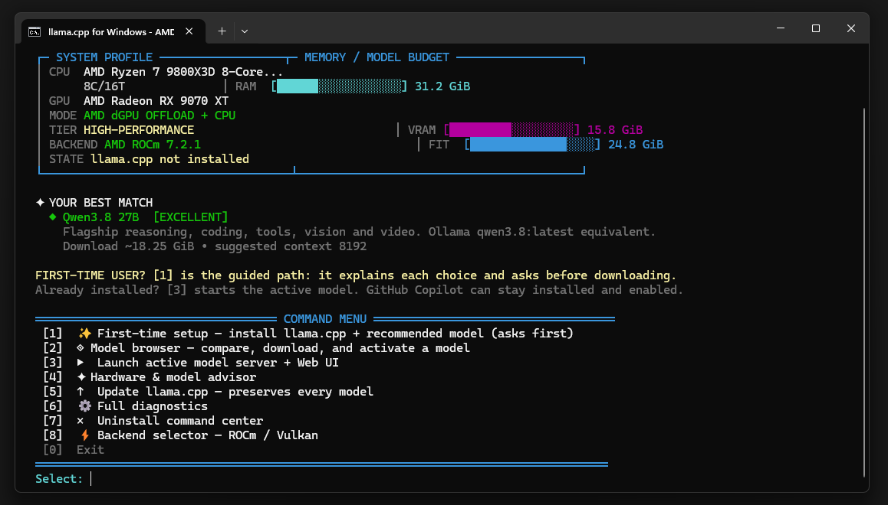
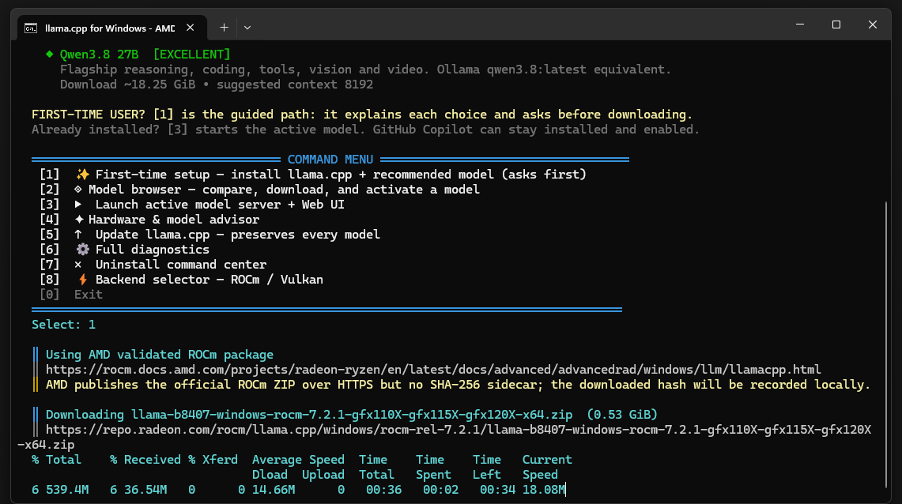
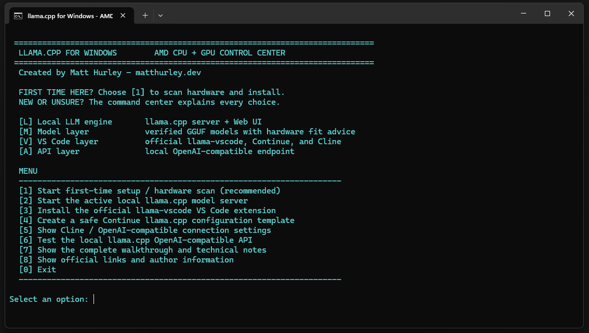

# llama.cpp AMD Windows Command Center

<p align="center">
  
</p>

**A hardware-aware Windows command center for llama.cpp, local models, and VS Code.**

Created by **Matt Hurley - [matthurley.dev](https://matthurley.dev)**

> Independent community project. Not affiliated with ggml-org, AMD, Microsoft, Anthropic, or the maintainers of the integrated editor extensions.

## Start here

**New to local LLMs?** You do not need to know ROCm, Vulkan, GGUF files, or API servers first. The command center explains the choices and asks before downloading.


1. Install or update the AMD Adrenalin driver.
2. Download this repository.
3. Double-click `Start-LlamaCpp.cmd`.
4. Select **Start first-time setup / hardware scan**.
5. Review the detected CPU, Radeon GPU, VRAM, RAM, backend, and model recommendation.
6. Install the selected backend and model.
7. Return to the batch menu and start the generated server launcher.
8. Test the local API, then connect VS Code.

The managed installation lives under `%LOCALAPPDATA%\Programs\llama.cpp`; model files are kept outside the source checkout.

## See the actual setup

These screenshots show the intended first-time experience: the hardware-aware dashboard, the verified model download, and the local server launch screen.

| First-time dashboard | Verified installation | Local server launch |
|---|---|---|
|  |  |  |

## One menu, four layers

| Layer | Purpose |
|---|---|
| **L — Local engine** | `llama-server.exe`, Web UI, localhost API |
| **M — Model** | GGUF discovery, hardware fit advice, revision resolution, SHA-256 verification |
| **V — VS Code** | Official llama-vscode, Continue, and Cline instructions |
| **A — API** | OpenAI-compatible local endpoint for compatible tools |

## Hardware-aware backend choice

### AMD ROCm

Automatic mode selects the validated AMD ROCm Windows package for supported Radeon dGPUs, including the RX 9070 XT when supported by the current AMD matrix.

### Vulkan

Vulkan is the fallback for Ryzen iGPUs, older Radeon GPUs, and hardware outside the ROCm package matrix. It uses the installed AMD Vulkan driver.

The batch front door makes the choice visible. The PowerShell command center performs the detailed hardware scan and lets the user override the backend when needed.

## Tested local target

The command center has been validated for a system with:

- AMD Ryzen 7 9800X3D, 8 cores / 16 threads
- AMD Radeon RX 9070 XT with approximately 15.8 GiB dedicated VRAM
- 31.2 GiB system RAM
- Radeon integrated GPU / UMA reporting
- Windows DXGI adapter inventory

For that target, the default model recommendation is Qwen3.8 27B Q4_K_M with its vision projector, exposed as `qwen3.8:latest`.

## Local endpoints

```text
Web UI: http://127.0.0.1:8080/
API:    http://127.0.0.1:8080/v1
Models: http://127.0.0.1:8080/v1/models
```

The server binds to `127.0.0.1` only.

## Using Copilot and a local model together

GitHub Copilot and llama.cpp can be used side by side. This project does not remove or reconfigure Copilot. Keep using Copilot Chat as usual, and use llama-vscode, Continue, or Cline when you want a request handled by your local model.

## Editor integrations

### Official llama-vscode

Install from VS Code using extension ID `ggml-org.llama-vscode`. It supports local completion, chat, agents, model/environment management, and Hugging Face model browsing.

### Continue

```yaml
name: Local llama.cpp
version: 0.0.1
schema: v1
models:
  - name: Qwen3.8 27B
    provider: llama.cpp
    model: qwen3.8:latest
    apiBase: http://127.0.0.1:8080
```

The batch menu can create `Continue-llamacpp-config.yaml` without overwriting an existing file.

### Cline / OpenAI-compatible clients

```text
Base URL: http://127.0.0.1:8080/v1
Model:    qwen3.8:latest
API key:  any non-empty placeholder
```

## Claude Code note

Claude Code is a separate CLI client. Its documented gateway setup uses `ANTHROPIC_BASE_URL` and an Anthropic-compatible gateway. The local llama.cpp OpenAI-compatible endpoint is not promised to be a direct Claude Code backend. A gateway or protocol adapter may be needed and must be tested against the Claude Code version in use.

## Beginner troubleshooting

- **API test fails:** start the server with option `[2]`, wait for model loading, then test with `[6]`.
- **`code` is not recognized:** VS Code may still be installed. Open VS Code > Extensions, search `llama-vscode`, and install it there; or add VS Code to PATH and reopen the terminal.
- **The model is slow:** choose the model browser or hardware/model advisor and try a smaller model or lower context setting.
- **The GPU is missing:** update AMD Adrenalin, reboot, and rerun diagnostics.
- **Starting over:** use the uninstall option in the command center; it asks for confirmation and does not remove VS Code or Copilot.

## Safety model

- Nothing is downloaded until the user chooses an installation or model action.
- Official HTTPS sources are used where available.
- Model downloads verify published Git LFS SHA-256 values.
- The AMD ROCm package has no publisher-side SHA-256 sidecar; the local downloaded hash is recorded instead.
- The local server is not exposed to the network.
- The Continue template is created separately and is not overwritten.
- The menu documents each action before running it.

## Project layout

```text
Start-LlamaCpp.cmd             Interactive colorful front end
Install-LlamaCpp-AMD.ps1       PowerShell command center
logo.png                       Project logo
docs/                          Documentation site
.github/workflows/pages.yml    GitHub Pages deployment
```

## Author

**Created by Matt Hurley - [matthurley.dev](https://matthurley.dev)**

MIT licensed. See the repository `LICENSE` file.
